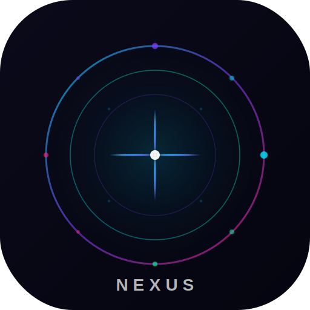

# ✦ NexusAI

> **Your All-in-One AI Universe** — Application Android ultra-premium avec accès à tous les grands modèles IA.

## 🚀 Features v1.0

| Module | Modèles | Capacités |
|--------|---------|-----------|
| ⚡ **OpenAI** | GPT-4.1, GPT-4o, o1-pro, o3 | Vision, Code, Chat |
| 🧠 **Chipp AI** | Gemini 2.5 Pro, 2.0 Flash | Fichiers, Images, Long contexte |
| 🔀 **RTM Router** | DeepSeek-R2, Kimi-K2, Llama 4, Qwen 3 | Multi-modèle open source |
| 🚀 **Groq Speed** | Llama 3.3 70B, Mixtral 8x7B | Ultra-rapide |
| 📥 **Downloader** | Facebook HD/SD | Téléchargement vidéo |

## ✨ Design

- **Dark glassmorphism** ultra-premium
- **Typographie** Syne + DM Sans + JetBrains Mono
- **Animations** fluides et micro-interactions
- **Markdown complet** avec blocs de code colorés
- **Export** conversation en .txt

## 🔒 Sécurité

- URL serveur **obfusquée en Base64** dans l'APK
- Clés API **uniquement sur Render** (jamais dans l'APK)
- Proxy sécurisé entre l'APK et les APIs IA

## 📦 Stack

- **Frontend** : Next.js 14 (App Router) + TypeScript + Tailwind CSS
- **Mobile** : Capacitor 6
- **Backend** : Express.js sur Render
- **Build** : GitHub Actions

## 📖 Guide Installation

Voir [TERMUX_GUIDE.md](TERMUX_GUIDE.md) pour les instructions complètes.

---

*v1.0 — Partie 1 de ∞ | Coming: Video DL avancé, Image Generator, Audio Tools*
